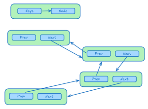

## Project Overview
LruCache is a .NET 10 library that demonstrates implementing a Least Recently Used Cache, which is a cache that only keeps a certain amount of items in memory depending on their usage. When the cache reaches capacity the least recently used item is discarded. Adding an item or getting an item moves it to the top of the cache, while old items fall off the end.

I first used a scratch pad to visualize the order of changing the Next and Previous references to implement LruCache.cs manually.

Afterwards I created LruCacheV2.cs using the framework's LinkedList, which simplifies the code. I could have done this in the first place, but I wanted to understand how it actually works which is why I created the manual version.

PS: I completely flubbed this during a coding interview which is funny now, but that is the nature of LeetCode tests.